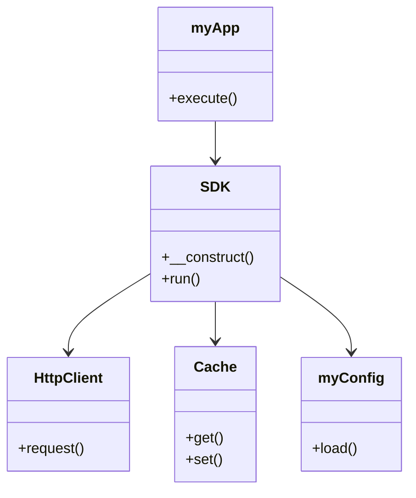

# xianjia_getui_sdk
 xianjia_getui_sdk_code 是一个为 个推（Getui）推送服务 封装的 PHP SDK 和示例代码项目。它的主要目的是简化开发者将个推的消息推送能力集成到 PHP 后端服务中的流程，提供了一系列针对个推 REST API 的 PHP 封装方法，包括：  单播/批量 CID 或别名推送 绑定/解绑别名（alias） 绑定自定义标签 查询设备状态、用户别名、CID 等 黑名单管理 推送结果状态追踪


# xianjia_getui_sdk


```angular2html
项目用途 

方面	说明
🧩 是什么？	一个封装了 个推（Getui）官方 REST API 的 PHP SDK，以及配套的调用示例
🎯 用来做什么？	帮助 PHP 开发者快速实现：消息推送、用户标签/别名管理、设备状态查询、黑名单等后台功能，无需直接调用复杂的个推 HTTP API
📦 提供了什么？	一系列封装好的 PHP 方法，如 push、bind_alias、find_cid、delete_alias 等
🧪 如何测试？	通过运行 demo/ 下的各个 PHP 文件，例如 find_alias.php、push_single_cid.php，可快速体验各项功能
⚙️ 依赖什么？	PHP 8.0+，以及通过 Composer 安装的 predis/predis（用于可选的 Redis 缓存）
✅ 总结一句话

xianjia_getui_sdk_code 是一个专为 PHP 开发者打造的个推（Getui）推送服务 SDK，封装了消息推送、别名管理、用户状态查询等功能，并通过丰富的 demo 示例展示如何使用，目标是让 PHP 后端快速、轻松地接入个推服务。

xianjia_getui_sdk_code 是一个为个推（Getui）推送服务封装的 PHP SDK 项目，目标是提供一套基于 REST API 的服务端推送功能，方便开发者集成个推的消息推送能力，如单播、批量推送、别名管理、标签绑定等功能。

xianjia_getui_sdk_code 是一个为 个推（Getui）推送服务 封装的 PHP SDK 和示例代码项目。它的主要目的是简化开发者将个推的消息推送能力集成到 PHP 后端服务中的流程，提供了一系列针对个推 REST API 的 PHP 封装方法，包括：

单播/批量 CID 或别名推送
绑定/解绑别名（alias）
绑定自定义标签
查询设备状态、用户别名、CID 等
黑名单管理
推送结果状态追踪


src/ 存放源代码文件
vendor/ 存放第三方依赖
composer.json 定义项目的元数据和依赖信息
README.md 项目的说明文档

|
|-- Core/
|    |-- HttpClient.php：负责发送 HTTP 请求到个推服务器，处理鉴权头、请求构造、响应解析及异常捕获。错误如 “target user is invalid” 就是在这里被捕获并转换为异常的。
|    |-- Cache.php：缓存管理类，支持 file / redis / session 等多种存储方式，默认使用文件缓存，也集成了 predis/predis 作为 Redis 客户端（但当前使用较少）。
|-- src/    包源码
|    |-- orm/ 数据库操作层 
|    |-- sitemap/ 业务处理
|    |-- fun.php	公共方法
|    |-- SDK.php核心类，封装了所有对接个推 REST API 的主要方法，例如：
|            推送功能（单播 / 批量 CID / 别名推送）
|            别名管理（绑定、查询、删除等）
|            用户状态查询、黑名单、标签绑定
|            HTTP 请求与鉴权逻辑
|    |-- myApp.php 对 SDK 的进一步封装，提供更易用的接口（如 push_single_alias()、find_alias() 等），便于在项目中直接调用，属于对 SDK 的 “应用层包装”。
|-- example  一些实例
|
|-- example_bin  一些实例
|--  |-- test.php 入口 
|
|-- README.md
|
|-- composer.json
|-- demo/

# 架构文档

## 项目结构

- **核心模块**
  - `src/SDK.php`: 主入口类
  - `src/Core/HttpClient.php`: HTTP客户端实现
  - `src/Core/Cache.php`: 缓存功能实现

- **配置模块**
  - `src/myConfig.php`: 配置管理类

- **应用模块**
  - `src/myApp.php`: 应用逻辑类

## 类关系图



## 功能描述

1. **SDK**: 提供主入口功能，协调其他模块的工作。
2. **HttpClient**: 处理HTTP请求，支持与外部服务的通信。
3. **Cache**: 提供数据缓存功能，提升性能。
4. **myConfig**: 管理应用配置，支持动态加载。
5. **myApp**: 封装业务逻辑，调用SDK完成功能。

## 依赖关系

- 项目依赖通过 `composer.json` 管理。
- 核心模块依赖于 `src/Core` 目录下的实现。


核心价值：提供各种常见使用场景的调用范例，可直接运行测试

该目录下包含多个 PHP 脚本，展示如何使用 SDK 提供的接口，例如：

文件	功能说明
push_single_cid.php	向单个 CID 推送消息
push_single_alias.php	向单个别名推送消息
push_single_batch_cid.php / push_single_batch_alias.php	批量向多个 CID / 别名推送
find_alias.php	通过别名或 CID 查询用户信息
bind_alias.php	绑定 CID 和 别名
delete_batch_alias.php / delete_all_alias.php	批量或全部删除别名绑定
find_cid.php	查询 CID 相关信息
bind_custom_tag.php	绑定自定义标签
set_badge.php	设置应用角标数字（iOS）
add_blacklist.php / delete_blacklist.php	用户黑名单管理
✅ 每个示例都包含：
引入 autoload
初始化配置（通过 myConfig 或直接调用）
调用 myApp 的方法（如 push_single_cid()、find_alias()）
打印返回的 JSON 结果
项目结构

src/: 存放源代码文件，包括核心功能、服务、客户端、配置、驱动、工厂、接口、ORM、服务器和站点地图等模块。
demo/: 包含一些示例文件和配置文件，用于演示如何使用该项目。
examples/: 可能包含更多的示例代码。
tests/: 测试文件目录。
vendor/: 第三方依赖库。
 