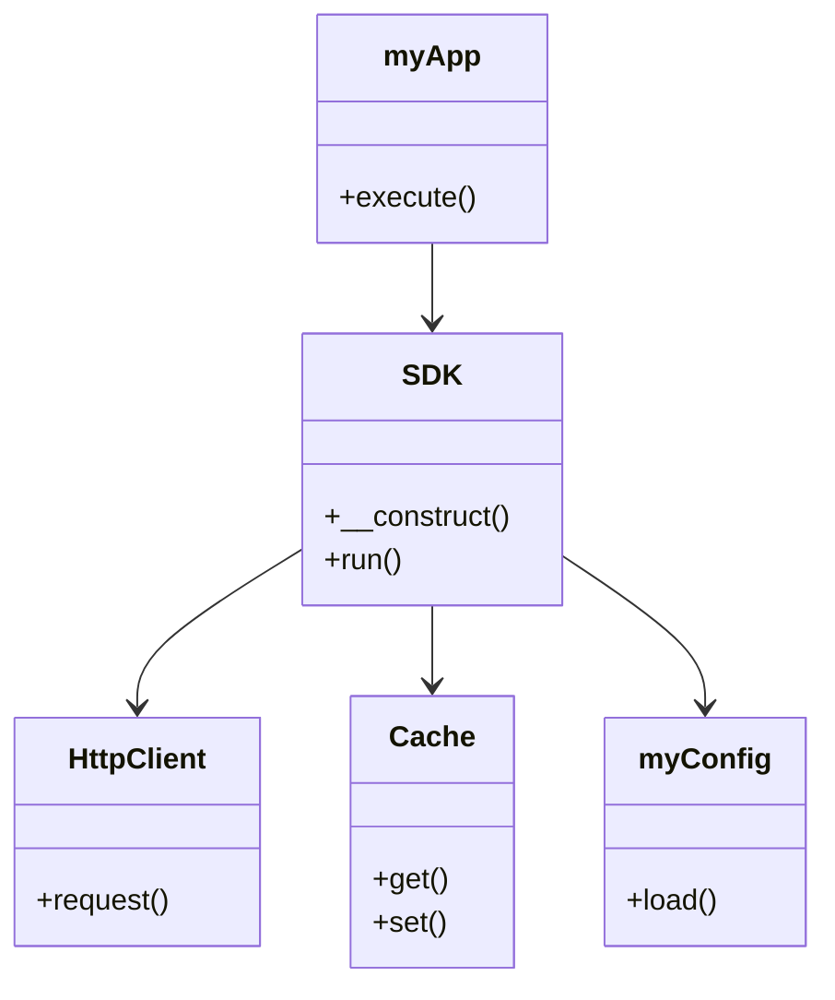

# 架构文档

## 项目结构

- **核心模块**
  - `src/SDK.php`: 主入口类
  - `src/Core/HttpClient.php`: HTTP客户端实现
  - `src/Core/Cache.php`: 缓存功能实现

- **配置模块**
  - `src/myConfig.php`: 配置管理类

- **应用模块**
  - `src/myApp.php`: 应用逻辑类

## 类关系图

## 功能描述

1. **SDK**: 提供主入口功能，协调其他模块的工作。
2. **HttpClient**: 处理HTTP请求，支持与外部服务的通信。
3. **Cache**: 提供数据缓存功能，提升性能。
4. **myConfig**: 管理应用配置，支持动态加载。
5. **myApp**: 封装业务逻辑，调用SDK完成功能。

## 依赖关系

- 项目依赖通过 `composer.json` 管理。
- 核心模块依赖于 `src/Core` 目录下的实现。
